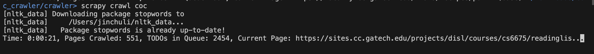
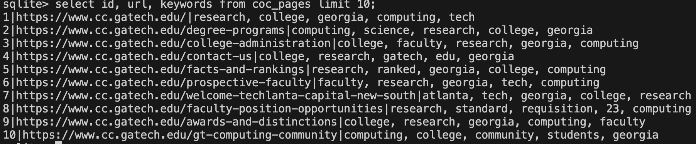
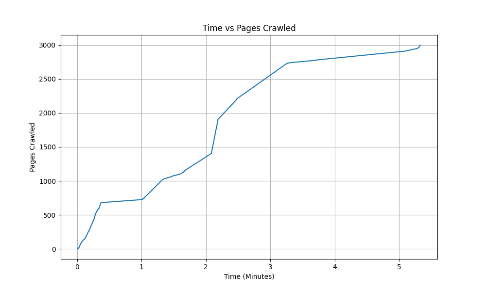
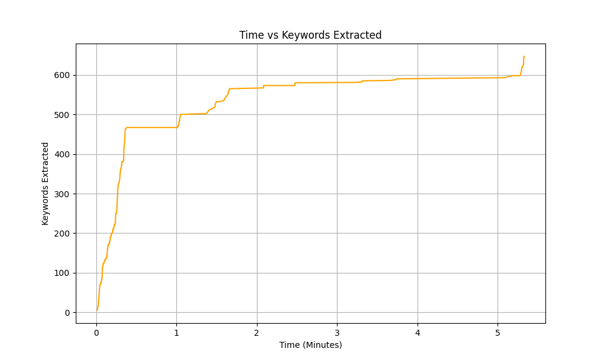
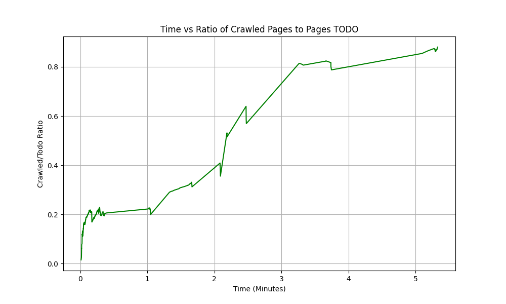

# COC Crawler
**Github Link: https://github.com/JinchuLi2002/coc_crawler**
## Introduction
This project utilizes Scrapy, a python-based open source web crawler to target and crawl web pages from `cc.gatech.edu`. The goal is to crawl at least 1000 URLs, extract relevant keywords, and store the crawled pages in a web archive (emulated via sqlite3 db). We also aim to analyze the crawl speed by plotting the number of extracted keywords and URLs.

## Install Dependencies
```
pip install -r requirements.txt
```

## Running the Crawler
1. **Set the Seed URL**:
   - Edit the seed URL in crawler/crawler/spiders/coc_spider.py, defaults to `cc.gatech.edu`.

2. **Start the Crawler**:
   - In `crawler/`, run `scrapy crawl coc`.

3. **Checking Results**:
   - To access the web archive, run `sqlite3 coc.db`.
   - To see the analysis plots, run `python crawler/plot_crawl_stats.py`
     - The corresponding tabular data is stored in `crawler/crawl_stats.csv`.

## Keywords Web Archive Design
For each crawled webpage, the top 5 most frequent words are selected as keywords, excluding stop words like "the", "a", "an", etc. The web archive is emulated via a sqlite3 database. The database schema is as follows:
```sql
CREATE TABLE IF NOT EXISTS coc_pages (
    id INTEGER PRIMARY KEY,
    url TEXT,
    content TEXT,
    keywords TEXT,
    crawl_time TIMESTAMP
);
```

## Screenshots
* Commandline

* Web Archive (Page content and timestamp omitted)

* Analysis Plots



## Discussion
The crawler took 319 seconds to crawl 3000 pages, averaging 9.4 pages per second. Therefore, it would take approximately 295 hours (12.31 days) to crawl 10 million pages and 3.37 years to crawl 1 billion pages. Therefore, it would require more computing power as well as a better optimization strategy to crawl at a larger scale.

From the graph, we can see that the crawling rate has slowed significantly over the last half, that is because those pages are mostly lecture slides from various classes, which may not be as relevant to other pages, it's possible to skip those pages to improve efficiency.

On another note, the crawler currently uses a hashset to keep track of visited pages, which is not scalable for large-scale crawling. When it comes to the scale of modern web, it'd be necessary to adopt a distributed architecture to handle the large amount of data.

